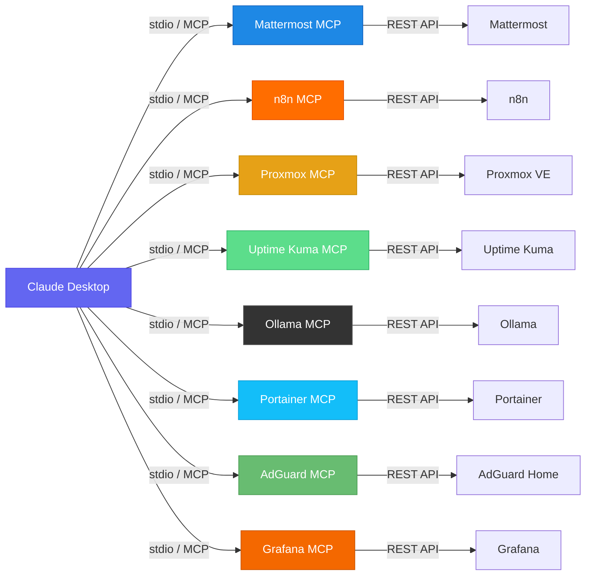

<div align="center">
  
</div>

<div align="center">

# Homelab MCP Bundle

**Steuere dein gesamtes Homelab mit natuerlicher Sprache. Kein Tab-Wechsel mehr.**

[](./LICENSE)
[](https://github.com/AI-Engineerings-at/homelab-mcp-bundle/stargazers)
[](https://modelcontextprotocol.io/)
[](https://www.python.org/)
[](#services)
[](https://www.docker.com/)

[English](./README.md) | [Deutsch](#)

</div>

---

## Inhaltsverzeichnis

- [Ueberblick](#ueberblick)
- [Architektur](#architektur)
- [Services](#services)
- [Schnellstart](#schnellstart)
- [Beispiele in natuerlicher Sprache](#beispiele-in-natuerlicher-sprache)
- [Voraussetzungen](#voraussetzungen)
- [Einzelne Server-Dokumentationen](#einzelne-server-dokumentationen)
- [Der vollstaendige Homelab AI Stack](#der-vollstaendige-homelab-ai-stack)
- [FAQ](#faq)
- [Mitarbeit](#mitarbeit)
- [Lizenz](#lizenz)

---

## Ueberblick

8 produktionserprobte MCP-Server. 40+ Tools. Keine externen Abhaengigkeiten ausser `mcp`.

Frag Claude *"Sind alle meine Services online?"* und erhalte einen Live-Status ueber Portainer, Uptime Kuma, Proxmox, n8n, AdGuard, Grafana, Ollama und Mattermost — alles in einer Konversation.

Keine Cloud. Kein Proxy. Keine Daten verlassen dein Netzwerk. Jeder Server ist unabhaengig — nutze nur die, die zu deinem Stack passen.

---

## Architektur



Jeder MCP-Server laeuft als lokaler Python-Prozess, der von Claude Desktop gestartet und verwaltet wird. Claude sendet Tool-Aufrufe ueber das [MCP-Protokoll](https://modelcontextprotocol.io/) (stdio), und jeder Server uebersetzt diese in direkte REST-API-Aufrufe an deinen selbst gehosteten Service.

---

## Services

| # | Server | Tools | Funktionen | Beispiel-Prompt |
|:-:|--------|:-----:|-----------|-----------------|
| 1 | [Portainer MCP](./portainer-mcp/) | 5 | Stacks, Services, Container auflisten; Logs abrufen; Health pruefen | *"Zeig mir alle laufenden Docker Swarm Services"* |
| 2 | [Proxmox MCP](./proxmox-mcp/) | 6 | VMs/LXCs auflisten, Node-Status, Ressourcennutzung, Start/Stop/Reboot | *"Wie ausgelastet ist mein Proxmox-Node gerade?"* |
| 3 | [n8n MCP](./n8n-mcp/) | 5 | Workflows auflisten, Ausfuehrungen starten, Fehler pruefen, Status verwalten | *"Welche n8n-Workflows sind heute fehlgeschlagen?"* |
| 4 | [Ollama MCP](./ollama-mcp/) | 4 | Modelle auflisten, herunterladen/loeschen, Texte generieren | *"Fasse diese Log-Datei mit llama3 zusammen"* |
| 5 | [Uptime Kuma MCP](./uptime-kuma-mcp/) | 3 | Monitor-Status, Uptime-Prozentsaetze, Ausfallerkennung | *"Sind alle meine Services online?"* |
| 6 | [Mattermost MCP](./mattermost-mcp/) | 5 | Nachrichten senden, Kanaele lesen, Verlauf durchsuchen, Teams auflisten | *"Poste 'Deployment erledigt' in #general"* |
| 7 | [AdGuard Home MCP](./adguard-mcp/) | 6 | DNS-Statistiken, Domains sperren/freigeben, Query-Log, Filterverwaltung | *"Wie viele DNS-Anfragen wurden heute geblockt?"* |
| 8 | [Grafana MCP](./grafana-mcp/) | 6 | Dashboards auflisten, Alerts pruefen, PromQL ausfuehren, Annotationen hinzufuegen | *"Gibt es aktive Grafana-Alerts?"* |

---

## Schnellstart

### 1. MCP-Bibliothek installieren

```bash
pip install mcp
# oder in einer virtuellen Umgebung:
python3 -m venv .venv && source .venv/bin/activate && pip install mcp
```

### 2. Repository klonen

```bash
git clone https://github.com/AI-Engineerings-at/homelab-mcp-bundle.git
cd homelab-mcp-bundle
```

### 3. Claude Desktop konfigurieren

Bearbeite `~/.config/claude/claude_desktop_config.json`
(macOS: `~/Library/Application Support/Claude/claude_desktop_config.json`)

```json
{
  "mcpServers": {
    "portainer": {
      "command": "python3",
      "args": ["/pfad/zu/homelab-mcp-bundle/portainer-mcp/server.py"],
      "env": {
        "PORTAINER_URL": "http://dein-portainer:9000",
        "PORTAINER_USER": "admin",
        "PORTAINER_PASSWORD": "dein-passwort"
      }
    },
    "proxmox": {
      "command": "python3",
      "args": ["/pfad/zu/homelab-mcp-bundle/proxmox-mcp/server.py"],
      "env": {
        "PVE_HOST": "deine-proxmox-ip",
        "PVE_USER": "root@pam",
        "PVE_PASSWORD": "dein-passwort"
      }
    },
    "n8n": {
      "command": "python3",
      "args": ["/pfad/zu/homelab-mcp-bundle/n8n-mcp/server.py"],
      "env": {
        "N8N_API_KEY": "dein-n8n-api-key",
        "N8N_BASE_URL": "http://dein-n8n:5678/api/v1"
      }
    },
    "ollama": {
      "command": "python3",
      "args": ["/pfad/zu/homelab-mcp-bundle/ollama-mcp/server.py"],
      "env": {
        "OLLAMA_BASE_URL": "http://localhost:11434",
        "OLLAMA_DEFAULT_MODEL": "llama3.2:3b"
      }
    },
    "uptime-kuma": {
      "command": "python3",
      "args": ["/pfad/zu/homelab-mcp-bundle/uptime-kuma-mcp/server.py"],
      "env": {
        "KUMA_BASE_URL": "http://dein-uptime-kuma:3001",
        "KUMA_STATUS_PAGE": "homelab"
      }
    },
    "mattermost": {
      "command": "python3",
      "args": ["/pfad/zu/homelab-mcp-bundle/mattermost-mcp/server.py"],
      "env": {
        "MM_TOKEN": "dein-mattermost-bot-token",
        "MM_BASE_URL": "http://dein-mattermost:8065/api/v4"
      }
    },
    "adguard": {
      "command": "python3",
      "args": ["/pfad/zu/homelab-mcp-bundle/adguard-mcp/server.py"],
      "env": {
        "ADGUARD_URL": "http://dein-adguard:3000",
        "ADGUARD_USER": "admin",
        "ADGUARD_PASSWORD": "dein-passwort"
      }
    },
    "grafana": {
      "command": "python3",
      "args": ["/pfad/zu/homelab-mcp-bundle/grafana-mcp/server.py"],
      "env": {
        "GRAFANA_URL": "http://dein-grafana:3000",
        "GRAFANA_API_KEY": "dein-grafana-api-key"
      }
    }
  }
}
```

Starte Claude Desktop neu — die Server erscheinen automatisch als Tools.

---

## Beispiele in natuerlicher Sprache

```
"Zeig mir alle VMs auf meinem Proxmox-Cluster"
  -> proxmox-mcp: vms_list() -> 12 VMs/LXCs auf 3 Nodes

"Sind alle meine Services online?"
  -> uptime-kuma-mcp: monitors_status() -> 28/28 UP

"Welche n8n-Workflows sind heute fehlgeschlagen?"
  -> n8n-mcp: executions_list(status="error") -> 2 fehlgeschlagen

"Schreib in #general: Deployment ist fertig"
  -> mattermost-mcp: posts_create(channel="general", ...) -> Gepostet

"Fasse dieses Error-Log mit llama3 zusammen"
  -> ollama-mcp: generate(prompt="...", model="llama3.2:3b") -> Zusammenfassung

"Zeig mir alle laufenden Docker Swarm Services"
  -> portainer-mcp: services_list() -> 22 Services auf 3 Nodes

"Wie viele DNS-Anfragen wurden heute geblockt?"
  -> adguard-mcp: stats() -> 45.230 Anfragen | 12.847 geblockt (28,4%)

"Blockiere ads.example.com"
  -> adguard-mcp: block_domain("ads.example.com") -> Regel hinzugefuegt

"Zeig aktuelle Grafana-Alerts"
  -> grafana-mcp: alerts_list() -> 1 aktiv: HighMemory auf node-1
```

---

## Voraussetzungen

- **Claude Desktop** (mit aktivierter MCP-Unterstuetzung)
- **Python 3.9+** und `pip install mcp` (einzige Bibliotheksabhaengigkeit)
- **Selbst gehostete Services**, die du anbinden willst:
  - Portainer CE oder BE (Docker Swarm oder Standalone)
  - Proxmox VE (aktuelle Version)
  - n8n (selbst gehostet, API-Key aktiviert)
  - Ollama (lokale LLM-Runtime)
  - Uptime Kuma (Status-Seite konfiguriert)
  - Mattermost (selbst gehostet, Bot-Token)
  - AdGuard Home
  - Grafana + Prometheus

Du brauchst nicht alle — jeder Server ist vollstaendig unabhaengig.

---

## Einzelne Server-Dokumentationen

- [Portainer MCP](./portainer-mcp/README.md)
- [Proxmox MCP](./proxmox-mcp/README.md)
- [n8n MCP](./n8n-mcp/README.md)
- [Ollama MCP](./ollama-mcp/README.md)
- [Uptime Kuma MCP](./uptime-kuma-mcp/README.md)
- [Mattermost MCP](./mattermost-mcp/README.md)
- [AdGuard Home MCP](./adguard-mcp/README.md)
- [Grafana MCP](./grafana-mcp/README.md)

---

## Der vollstaendige Homelab AI Stack

Dieses Bundle ist Teil von **Playbook 01 — Der Lokale AI-Stack**, einem vollstaendigen Leitfaden zum Aufbau einer produktionsreifen, selbst gehosteten AI-Infrastruktur mit Docker Swarm, n8n-Automatisierung, Grafana-Monitoring und Claude Desktop-Integration.

**[Playbook 01 auf ai-engineering.at](https://www.ai-engineering.at)**

Enthalten:
- Komplettes Docker Swarm Setup (Portainer, Grafana, Prometheus, n8n, Ollama)
- 13 importfertige n8n AI-Automatisierungs-Workflows
- 22 Grafana-Dashboards fuer Homelab-Monitoring
- AIOps-Alert-Pipeline mit lokaler LLM-Analyse
- Schritt-fuer-Schritt-Anleitung (70 Seiten, DE/EN)

---

## FAQ

<details>
<summary><strong>Brauche ich ein Cloud-LLM oder eine kostenpflichtige API?</strong></summary>

Nein, keine Cloud noetig. Jeder Server in diesem Bundle macht direkte HTTP-Aufrufe an deine selbst gehosteten Services — nichts verlasst jemals dein Netzwerk. Der `ollama-mcp`-Server verbindet sich mit einer lokalen Ollama-Instanz auf deiner eigenen Hardware. Du kannst den gesamten Stack komplett offline betreiben. Die einzige "Cloud"-Komponente ist Claude Desktop selbst, das die MCP-Server lokal auf deinem Rechner ausfuehrt.
</details>

<details>
<summary><strong>Welche Version von Claude Desktop wird benoetigt?</strong></summary>

Jede Version von Claude Desktop, die MCP (Model Context Protocol) unterstuetzt. MCP-Unterstuetzung wurde Ende 2024 eingefuehrt. Wenn dein Claude Desktop einen "Tools"-Bereich zeigt und die Konfiguration von `mcpServers` in der Konfigurationsdatei erlaubt, funktioniert es. Pruefe [modelcontextprotocol.io](https://modelcontextprotocol.io/) fuer die neuesten Kompatibilitaetsinformationen.
</details>

<details>
<summary><strong>Kann ich die Server nutzen, ohne alle 8 Services laufen zu haben?</strong></summary>

Ja. Jeder MCP-Server ist vollstaendig unabhaengig. Du kannst einen, drei oder alle acht nutzen — Claude Desktop startet nur die Server, die du konfigurierst. Wenn du nur Proxmox und Grafana betreibst, fuege nur diese zwei zu deiner `claude_desktop_config.json` hinzu und ignoriere den Rest. Es gibt keine gemeinsamen Abhaengigkeiten zwischen den Servern.
</details>

<details>
<summary><strong>Wie aktualisiere ich die Server nach dem Pullen neuer Aenderungen?</strong></summary>

```bash
cd homelab-mcp-bundle
git pull
```

Dann starte Claude Desktop neu. Die Server sind einfache Python-Skripte — es gibt nichts zu kompilieren oder zu bauen. Claude Desktop startet bei jedem Start einen frischen Prozess fuer jeden Server, sodass der neue Code sofort nach dem Neustart wirksam wird.
</details>

<details>
<summary><strong>Kann ich diese MCP-Server mit Claude.ai im Browser nutzen?</strong></summary>

Nein. MCP ist ein lokales Protokoll, das zwischen Claude Desktop (der nativen App) und lokalen Server-Prozessen auf deinem Rechner laeuft. Es ist nicht in der Claude.ai-Weboberflaeche verfuegbar. Du brauchst die Claude Desktop-App auf deinem Computer installiert, um MCP-Server zu nutzen.
</details>

<details>
<summary><strong>Mein Service ist nicht in diesem Bundle. Wie baue ich einen eigenen MCP-Server?</strong></summary>

Siehe [CONTRIBUTING.md](./CONTRIBUTING.md) fuer eine vollstaendige Schritt-fuer-Schritt-Anleitung mit funktionsfaehigem Grundgeruest. Die Kurzversion:

1. Erstelle ein neues Verzeichnis `dein-service-mcp/`
2. Kopiere die Struktur von `portainer-mcp/` als Ausgangsbasis
3. Ersetze die API-Aufrufe durch die REST API deines Services
4. Fuege deine Tool-Funktionen mit `@mcp.tool()` hinzu
5. Fuege es zu deiner Claude Desktop-Konfiguration hinzu

Jeder Service mit einer REST API kann auf diese Weise in einen MCP-Server verpackt werden. Das Ganze dauert typischerweise weniger als eine Stunde fuer einen einfachen Service.
</details>

<details>
<summary><strong>Funktioniert das unter Windows?</strong></summary>

Ja, ueber zwei Wege:

- **WSL2 (empfohlen)**: Fuehre die Python-Server innerhalb des Windows Subsystem for Linux aus. Die Claude Desktop-Konfiguration unter Windows verwendet das WSL-Pfadformat: `wsl.exe python3 /home/user/homelab-mcp-bundle/portainer-mcp/server.py`. Das ist der zuverlaessigste Ansatz.
- **Natives Python unter Windows**: Installiere Python 3.9+ von python.org, fuehre `pip install mcp` aus und verwende Windows-Pfade in deiner Konfiguration. Alle Server nutzen nur die Standardbibliothek plus `mcp`, es gibt keine Linux-spezifischen Abhaengigkeiten.
</details>

---

## Mitarbeit

Issues und PRs sind willkommen. Wenn du einen neuen MCP-Server fuer einen selbst gehosteten Service baust, erstelle einen PR!

Siehe [CONTRIBUTING.md](./CONTRIBUTING.md) fuer die vollstaendige Anleitung: wie man einen Server hinzufuegt, Code-Style, Tests und die PR-Checkliste.

Gib diesem Repo einen Stern, wenn es dir Zeit gespart hat. Es hilft anderen, es zu finden.

---

## Lizenz

MIT — siehe [LICENSE](./LICENSE)

Frei nutzbar, modifizierbar und verteilbar. Nennung wird geschaetzt, ist aber nicht erforderlich.
