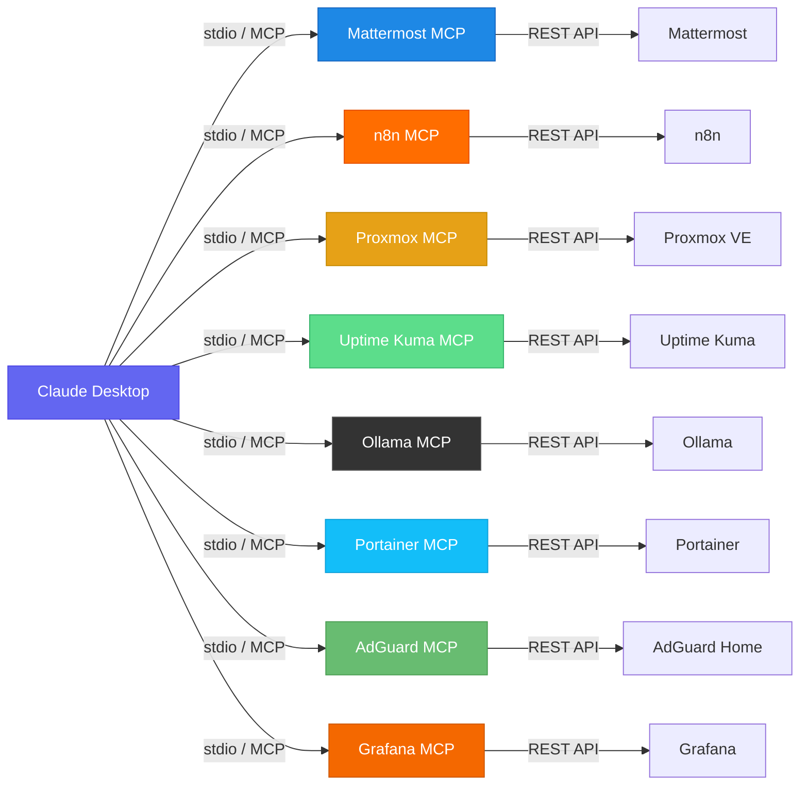

<div align="center">
  
</div>

<div align="center">

# Homelab MCP Bundle

**Control your entire homelab through natural language. No more switching tabs.**

[](./LICENSE)
[](https://github.com/AI-Engineerings-at/homelab-mcp-bundle/stargazers)
[](https://modelcontextprotocol.io/)
[](https://www.python.org/)
[](#services)
[](https://www.docker.com/)

[English](#) | [Deutsch](./README-DE.md)

</div>

---

## Table of Contents

- [Overview](#overview)
- [Architecture](#architecture)
- [Services](#services)
- [Quick Install](#quick-install)
- [Natural Language Examples](#natural-language-examples)
- [Requirements](#requirements)
- [Individual Server Docs](#individual-server-docs)
- [Get the Full Homelab AI Stack](#get-the-full-homelab-ai-stack)
- [FAQ](#faq)
- [Contributing](#contributing)
- [License](#license)

---

## Overview

8 production-tested MCP servers. 40+ tools. Zero external dependencies beyond `mcp`.

Ask Claude *"Are all my services up?"* and get a live status across Portainer, Uptime Kuma, Proxmox, n8n, AdGuard, Grafana, Ollama, and Mattermost — all from one conversation.

No cloud. No proxy. No data leaves your network. Each server is independent — use only the ones that match your stack.

---

## Architecture



Each MCP server runs as a local Python process started and managed by Claude Desktop. Claude sends tool calls via the [MCP protocol](https://modelcontextprotocol.io/) (stdio), and each server translates them into direct REST API calls to your self-hosted service.

---

## Services

| # | Server | Tools | Capabilities | Example Prompt |
|:-:|--------|:-----:|-------------|----------------|
| 1 | [Portainer MCP](./portainer-mcp/) | 5 | List stacks, services, containers; tail logs; inspect health | *"Show all running Docker Swarm services"* |
| 2 | [Proxmox MCP](./proxmox-mcp/) | 6 | List VMs/LXCs, node status, resource usage, start/stop/reboot | *"How loaded is my Proxmox node right now?"* |
| 3 | [n8n MCP](./n8n-mcp/) | 5 | List workflows, trigger executions, check failures, manage state | *"Which n8n workflows failed today?"* |
| 4 | [Ollama MCP](./ollama-mcp/) | 4 | List models, pull/delete models, generate completions | *"Summarize this log file with llama3"* |
| 5 | [Uptime Kuma MCP](./uptime-kuma-mcp/) | 3 | Monitor status, uptime percentages, outage detection | *"Are all my services up?"* |
| 6 | [Mattermost MCP](./mattermost-mcp/) | 5 | Post messages, read channels, search history, list teams | *"Post 'Deployment done' to #general"* |
| 7 | [AdGuard Home MCP](./adguard-mcp/) | 6 | DNS stats, block/unblock domains, query log, filter management | *"How many DNS queries were blocked today?"* |
| 8 | [Grafana MCP](./grafana-mcp/) | 6 | List dashboards, check alerts, run PromQL, add annotations | *"Are there any firing Grafana alerts?"* |

---

## Quick Install

### 1. Install the MCP library

```bash
pip install mcp
# or in a virtual environment:
python3 -m venv .venv && source .venv/bin/activate && pip install mcp
```

### 2. Clone this repo

```bash
git clone https://github.com/AI-Engineerings-at/homelab-mcp-bundle.git
cd homelab-mcp-bundle
```

### 3. Configure Claude Desktop

Edit `~/.config/claude/claude_desktop_config.json`
(macOS: `~/Library/Application Support/Claude/claude_desktop_config.json`)

```json
{
  "mcpServers": {
    "portainer": {
      "command": "python3",
      "args": ["/path/to/homelab-mcp-bundle/portainer-mcp/server.py"],
      "env": {
        "PORTAINER_URL": "http://your-portainer:9000",
        "PORTAINER_USER": "admin",
        "PORTAINER_PASSWORD": "your-password"
      }
    },
    "proxmox": {
      "command": "python3",
      "args": ["/path/to/homelab-mcp-bundle/proxmox-mcp/server.py"],
      "env": {
        "PVE_HOST": "your-proxmox-ip",
        "PVE_USER": "root@pam",
        "PVE_PASSWORD": "your-password"
      }
    },
    "n8n": {
      "command": "python3",
      "args": ["/path/to/homelab-mcp-bundle/n8n-mcp/server.py"],
      "env": {
        "N8N_API_KEY": "your-n8n-api-key",
        "N8N_BASE_URL": "http://your-n8n:5678/api/v1"
      }
    },
    "ollama": {
      "command": "python3",
      "args": ["/path/to/homelab-mcp-bundle/ollama-mcp/server.py"],
      "env": {
        "OLLAMA_BASE_URL": "http://localhost:11434",
        "OLLAMA_DEFAULT_MODEL": "llama3.2:3b"
      }
    },
    "uptime-kuma": {
      "command": "python3",
      "args": ["/path/to/homelab-mcp-bundle/uptime-kuma-mcp/server.py"],
      "env": {
        "KUMA_BASE_URL": "http://your-uptime-kuma:3001",
        "KUMA_STATUS_PAGE": "homelab"
      }
    },
    "mattermost": {
      "command": "python3",
      "args": ["/path/to/homelab-mcp-bundle/mattermost-mcp/server.py"],
      "env": {
        "MM_TOKEN": "your-mattermost-bot-token",
        "MM_BASE_URL": "http://your-mattermost:8065/api/v4"
      }
    },
    "adguard": {
      "command": "python3",
      "args": ["/path/to/homelab-mcp-bundle/adguard-mcp/server.py"],
      "env": {
        "ADGUARD_URL": "http://your-adguard:3000",
        "ADGUARD_USER": "admin",
        "ADGUARD_PASSWORD": "your-password"
      }
    },
    "grafana": {
      "command": "python3",
      "args": ["/path/to/homelab-mcp-bundle/grafana-mcp/server.py"],
      "env": {
        "GRAFANA_URL": "http://your-grafana:3000",
        "GRAFANA_API_KEY": "your-grafana-api-key"
      }
    }
  }
}
```

Restart Claude Desktop — the servers appear as tools automatically.

---

## Natural Language Examples

```
"Show me all VMs on my Proxmox cluster"
  -> proxmox-mcp: vms_list() -> 12 VMs/LXCs across 3 nodes

"Are all my services up?"
  -> uptime-kuma-mcp: monitors_status() -> 28/28 UP

"Which n8n workflows failed today?"
  -> n8n-mcp: executions_list(status="error") -> 2 failed

"Write to #general: Deployment is done"
  -> mattermost-mcp: posts_create(channel="general", ...) -> Posted

"Summarize this error log with llama3"
  -> ollama-mcp: generate(prompt="...", model="llama3.2:3b") -> Summary

"Show me all running Docker Swarm services"
  -> portainer-mcp: services_list() -> 22 services across 3 nodes

"How many DNS queries were blocked today?"
  -> adguard-mcp: stats() -> 45,230 queries | 12,847 blocked (28.4%)

"Block ads.example.com"
  -> adguard-mcp: block_domain("ads.example.com") -> Rule added

"Show current Grafana alerts"
  -> grafana-mcp: alerts_list() -> 1 firing: HighMemory on node-1
```

---

## Requirements

- **Claude Desktop** (with MCP support enabled)
- **Python 3.9+** and `pip install mcp` (the only library dependency)
- **Self-hosted services** you want to connect:
  - Portainer CE or BE (Docker Swarm or standalone)
  - Proxmox VE (any recent version)
  - n8n (self-hosted, API key enabled)
  - Ollama (local LLM runtime)
  - Uptime Kuma (status page configured)
  - Mattermost (self-hosted, bot token)
  - AdGuard Home
  - Grafana + Prometheus

You don't need all of them — each server is fully independent.

---

## Individual Server Docs

- [Portainer MCP](./portainer-mcp/README.md)
- [Proxmox MCP](./proxmox-mcp/README.md)
- [n8n MCP](./n8n-mcp/README.md)
- [Ollama MCP](./ollama-mcp/README.md)
- [Uptime Kuma MCP](./uptime-kuma-mcp/README.md)
- [Mattermost MCP](./mattermost-mcp/README.md)
- [AdGuard Home MCP](./adguard-mcp/README.md)
- [Grafana MCP](./grafana-mcp/README.md)

---

## Get the Full Homelab AI Stack

This bundle is part of **Playbook 01 — Der Lokale AI-Stack**, a complete guide to building a production-grade, self-hosted AI infrastructure with Docker Swarm, n8n automation, Grafana monitoring, and Claude Desktop integration.

**[Get Playbook 01 at ai-engineering.at](https://www.ai-engineering.at)**

Includes:
- Complete Docker Swarm setup (Portainer, Grafana, Prometheus, n8n, Ollama)
- 13 ready-to-import n8n AI automation workflows
- 22 Grafana dashboards for homelab monitoring
- AIOps alert pipeline with local LLM analysis
- Step-by-step setup guide (70 pages, DE/EN)

---

## FAQ

<details>
<summary><strong>Do I need a cloud LLM or a paid API?</strong></summary>

No cloud required. Every server in this bundle makes direct HTTP calls to your self-hosted services — nothing ever leaves your network. The `ollama-mcp` server connects to a local Ollama instance running on your own hardware. You can run the entire stack completely offline. The only "cloud" component is Claude Desktop itself, which runs the MCP servers locally on your machine.
</details>

<details>
<summary><strong>What version of Claude Desktop is required?</strong></summary>

Any version of Claude Desktop that supports MCP (Model Context Protocol). MCP support was introduced in late 2024. If your Claude Desktop shows a "Tools" section and allows you to configure `mcpServers` in the config file, it will work. Check [modelcontextprotocol.io](https://modelcontextprotocol.io/) for the latest compatibility information.
</details>

<details>
<summary><strong>Can I use these servers without having all 8 services running?</strong></summary>

Yes. Each MCP server is completely independent. You can use one, three, or all eight — Claude Desktop only starts the servers you configure. If you only run Proxmox and Grafana, just add those two to your `claude_desktop_config.json` and ignore the rest. There are no shared dependencies between servers.
</details>

<details>
<summary><strong>How do I update the servers after pulling new changes?</strong></summary>

```bash
cd homelab-mcp-bundle
git pull
```

Then restart Claude Desktop. The servers are plain Python scripts — there is nothing to compile or rebuild. Claude Desktop starts a fresh process for each server on every launch, so the new code takes effect immediately after restart.
</details>

<details>
<summary><strong>Can I use these MCP servers with Claude.ai in the browser?</strong></summary>

No. MCP is a local protocol that runs between Claude Desktop (the native app) and local server processes on your machine. It is not available in the Claude.ai web interface. You need the Claude Desktop app installed on your computer to use MCP servers.
</details>

<details>
<summary><strong>My service is not in this bundle. How do I build a custom MCP server?</strong></summary>

See the [CONTRIBUTING.md](./CONTRIBUTING.md) for a complete step-by-step guide with a working skeleton. The short version:

1. Create a new directory `your-service-mcp/`
2. Copy the structure from `portainer-mcp/` as a starting template
3. Replace the API calls with your service's REST API
4. Add your tool functions decorated with `@mcp.tool()`
5. Add it to your Claude Desktop config

Any service with a REST API can be wrapped in an MCP server this way. The whole thing typically takes under an hour for a simple service.
</details>

<details>
<summary><strong>Does this work on Windows?</strong></summary>

Yes, via two approaches:

- **WSL2 (recommended)**: Run the Python servers inside Windows Subsystem for Linux. The Claude Desktop config on Windows uses the WSL path format: `wsl.exe python3 /home/user/homelab-mcp-bundle/portainer-mcp/server.py`. This is the most reliable approach.
- **Native Python on Windows**: Install Python 3.9+ from python.org, run `pip install mcp`, and use Windows-style paths in your config. All servers use only the standard library plus `mcp`, so there are no Linux-only dependencies.
</details>

---

## Contributing

Issues and PRs welcome. If you add a new MCP server for a self-hosted service, open a PR!

See [CONTRIBUTING.md](./CONTRIBUTING.md) for the full guide: how to add a server, code style, testing, and the PR checklist.

Star this repo if it saved you time. It helps others find it.

---

## License

MIT — see [LICENSE](./LICENSE)

Free to use, modify, and distribute. Attribution appreciated but not required.
